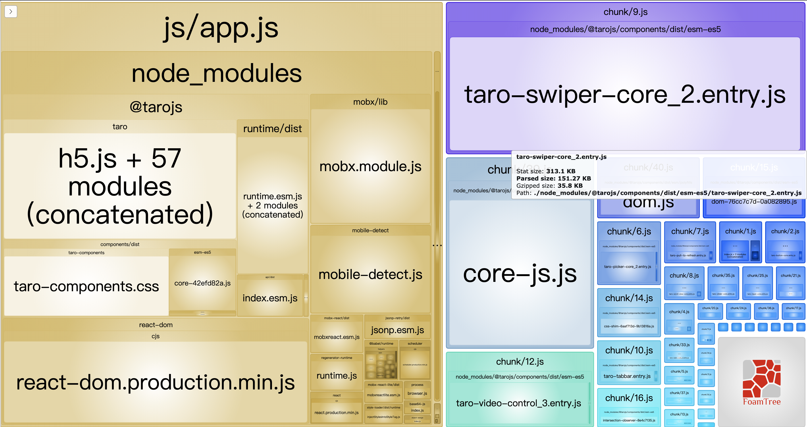

# Taro 3.0 项目模板

技术栈：
- Taro
- React
- Mobx

## 关于 process.env.NODE_ENV

在 config/index.js 中访问到的 process.env.NODE_ENV 和 src目录下的文件访问到的 process.env.NODE_ENV, 其实不是一个东西。

分两种情况：

1. 无任何自定义的情况

在config文件中不声明 env.NODE_ENV， 则在src目录下读取到的 process.env.NODE_ENV 的值 为 development(watch模式) 和 production

在脚本命令中不传入 --env , 则在 config/index.js 文件中读取到的 process.env.NODE_ENV 为 development(watch模式) 和 production

可以看到，如果没有任何自定义操作，那么在config和src中读取到的 process.env.NODE_ENV 值是一致的，都只有 development 和 production 两个值。

2. 脚本中传入 --env 变量

```bash
taro build --type h5 --env dev
```

如上，可在脚本中传入 --env 参数，在 config/index.js 中可以读取到 process.env.NODE_ENV 的值为 dev

通过这种方式，编写多个脚本，然后在 config/index.js 中通过判断 process.env.NODE_ENV的值，使用不同的配置文件，达到根据不同环境区分编译配置的目的。

```js
// config/index.js
module.exports = function (merge) {
	let exportConfig = {}
	const ENV = process.env.NODE_ENV
	if (ENV === 'pro') {
		exportConfig = merge({}, config, require('./pro'))
	} else if (ENV === 'sit') {
		exportConfig = merge({}, config, require('./sit'))
	} else if (ENV === 'uat') {
		exportConfig = merge({}, config, require('./uat'))
	} else if (ENV === 'local') {
		exportConfig = merge({}, config, require('./local'))
	} else {
		exportConfig = merge({}, config, require('./dev'))
	}
	return exportConfig
}
```

3. 在配置文件中声明 env.NODE_ENV

通过第2步，我们已经可以在 config/index.js 中区分不同环境使用不同的配置文件了，但是仍然无法在src目录下读取到具体的环境，这时候就需要在配置中声明 env.NODE_ENV 来实现了。

声明 env.NODE_ENV，只是覆盖了 taro 编译过程中给的默认 development 和 production 值，所以我们不如另起一个名字，如APP_ENV：

```js
// config/dev.js
module.exports = {
  env: {
    APP_ENV: '"dev"'
  }
}
```

在 src 目录下的项目代码中，即可通过 process.env.APP_ENV 读取到对应环境配置中声明的值了。

## 优化

1. 如果h5端编译后体积过大，可以使用webpack-bundle-analyzer插件对打包体积进行分析。

```js
module.exports = {
  h5: {
		webpackChain( chain ) {
			chain.plugin( 'analyzer' )
				.use( require( 'webpack-bundle-analyzer' ).BundleAnalyzerPlugin, [] )
		}
	}
}
```

在打包之后将会在浏览器中打开类似如下的页面，可以对文件占用体积分析，进行相关优化。


